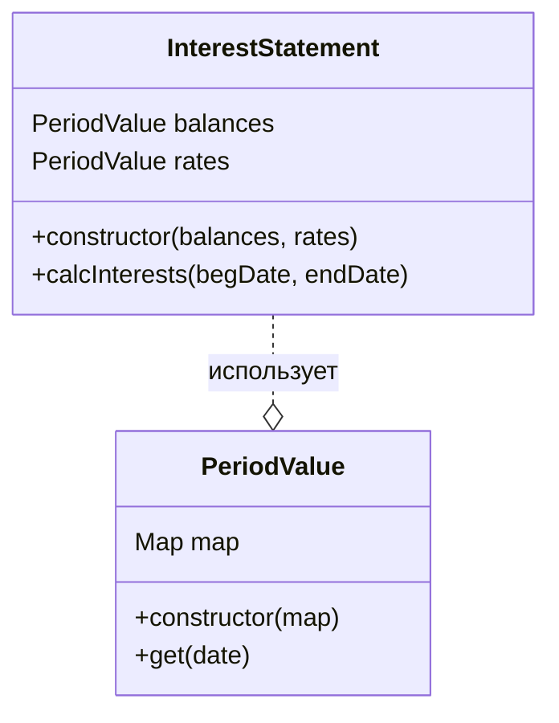

# Процентная ведомость

## Сущности

### InterestStatement

Сущность формирует процентную ведомость за период. Выписка разбивается на периоды постоянства ставки и остатка и на месяцы (%% за каждый месяц рассчитываются раздельно).

Входные данные:
| Поле      | Описание |
| ----------- | ----------- |
| balances      | остатки на дату       |
| rates   | ставки на дату        |
| begDate   | дата начала ведомости   |
| endDate   | дата окончания ведомости  |

Выходные данные:
Таблица
