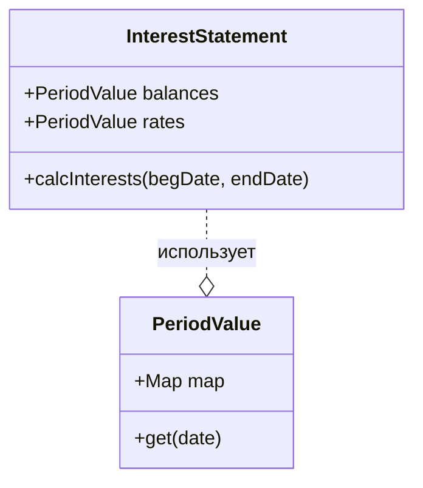

# Процентная ведомость

## Сущности

```mermaid
classDiagram
      class InterestStatement{
          +PeriodValue balances
          +PeriodValue rates
          +calcInterests(begDate, endDate)
      }
      class PeriodValue{
          +Map map
          +get(date)
      }

      InterestStatement ..o PeriodValue: использует
```